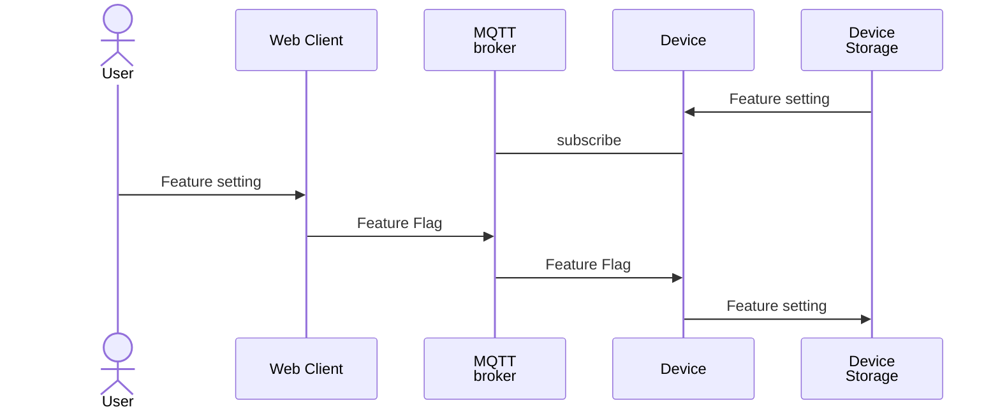

# iot-feature-flag-example
The example of feature flag for IoT device

## Overview

## Environments

All environments can be run in Dev Containers in Visual Studio Code. "Reopen in Container" in Visual Studio Code. Please refer to each environment's README for detail.

### Device

- ESP32
- [ESP-IDF](https://docs.espressif.com/projects/esp-idf/en/stable/esp32/index.html) v5.4

### MQTT Broker

- [EMQX](https://www.emqx.com/ja) v5.4.8

### Frontend

- Vite 6.0.5
- React 19.0.0
- [MQTT.js](https://github.com/mqttjs/MQTT.js) 5.10.3

## License

[MIT License](LICENSE)

## Author

[toms74209200](<https://github.com/toms74209200>)
